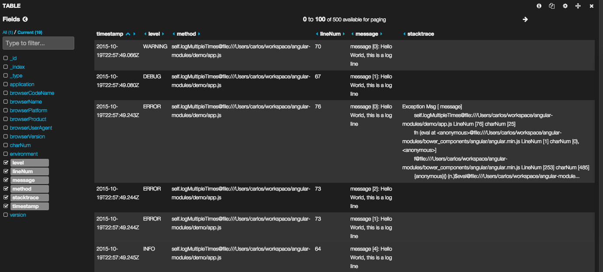

[](https://travis-ci.org/cmanaha/angular-loggly-logger)
[](https://coveralls.io/github/cmanaha/angular-elasticsearch-logger?branch=master)
[](https://gitter.im/cmanaha/angular-elasticsearch-logger?utm_source=badge&utm_medium=badge&utm_campaign=pr-badge)

# AngularJS Elasticsearch Logger Service

This module provides an implementation of an AngularJS Service (actually a provider implementation) that allows user to log into [Elasticsearch](http://elastic.io)

### Installation

To install the module use:

```
bower install angular-elasticsearch-logger --save
```

### Getting started

There are a few settings that need to be setup for the module to work properly.
Make sure that your angular application defines a dependency to the module

```javascript
angular
	.module('yourAngularApp', [
		...
    	'cmanaha.angular-elasticsearch-logger'
  	]);
```

Then your module/application needs a section for the Provider tha configures the _CMRESLoggerProvider_ such as the one as follows:

```javascript
angular
    .module('yourAngularApp')
    .config(['CMRESLoggerProvider',function ( esLoggingProvider) {
        esLoggingProvider.setElasticSearchConfig({
            'host': 'http://localhost:9200',
            'apiVersion': '1.7'
        });

       esLoggingProvider.setLogConfig({
            'index': 'demo_app_index',
            'type': 'jslog',
            'bufferSize': 2500,
            'flushIntervalInMS': 3000
        });

        esLoggingProvider.setApplicationLogContext({
            'appNameTag': 'MyDemoApp',
            'envTag': 'Development'
        });
    }]);
```
In this case the configuration points to a cluster at http://localhost:9200. the _esLoggingProvider.setElasticSearchConfig(config)_ takes a configuration object with any value defined accepted by [elasticsearch.js library](https://www.elastic.co/guide/en/elasticsearch/client/javascript-api/current/configuration.html)

_esLoggingProvider.setLogConfig(config)_ takes an object that can be used to set up the details of how the logger will connect and insert into Elasticsearch such as the name of the index where logs will be stored.

The _esLoggingProvider.setApplicationLogContext(config)_ takes an object with any arbitrary keys and values, this gets appended to any new log line that gets inserted to elasticsearch as an extra field to the document; Applications may add extra parameters to identify and create categories in their application (for example to differenciate between environments).

**Note:** you need to add to your scripts dependencies the following scripts, 
```html
<script src="bower_components/elasticsearch/elasticsearch.js"></script>
<script src="bower_components/elasticsearch/elasticsearch.angular.js"></script>
<script src="bower_components/stacktrace-js/stacktrace.js"></script>
<script src="bower_components/angular-elasticsearch-logger/angular-elasticsearch-logger.js"></script>
```

The last step required is to make sure you add the dependency with your services/controllers and use the _CMRESLogger_ service.

```javascript
angular
    .module('yourAngularApp')
    .controller( 'MyCtrl', ['CMRESLogger',function(CMRESLogger){
		CMRESLogger.info( 'hello world' );
		CMRESLogger.debug( 'hello world' );
		CMRESLogger.warning( 'hello world' );
		CMRESLogger.error( 'hello world' );
    }]);
```

The logger provide some functionality similar to log4net and log4j where aside from passing the log message the user can pass a thread context map; This can be used to 
as instrumentation and can be quite useful to log additional information that can be 
charted with Kibana. 

The following example shows an operation where aside from the log, the duration of an
operation is stored into elasticsearch as additional contextual parameter so it can
be graphed and instrumented not only just as a log message.

```javascript
angular
    .module('yourAngularApp')
    .controller( 'MyCtrl', ['CMRESLogger',function(CMRESLogger){
        ...
        //perform operation and get instrumentation timings

        var timeInMS = 440;

        var instrumentationContext = {};
        extraInstrumentationCtx['totalTimeInMS'] =  timeInMS;
        extraInstrumentationCtx['operationType'] = 'http_op';

        CMRESLogger.info( 'Completed operation in  '+timeInMS+', extraInstrumentationCtx);

    }]);
```


### Configuration

The _CMRESLoggerProvider_ does also accept an extra configuration object that configures the internal behaviour of the logger on things such as how to buffer and submit to elasticsearch.

The service internally buffers all the logs and sends the documents using the [bulk API](https://www.elastic.co/guide/en/elasticsearch/client/javascript-api/current/api-reference.html#api-bulk) to ensure the scalability of log insertion.

 - _index_ : (string) Is the index that will be used (additionally the date will be post-fixed)
 - _type_ : (string) Elasticsearch documet type that should be used when inserting documents
 - _bufferSize_ : (integer) The number of log to buffer before submitting a bulk request to Elasticsearch. If that number if exceeded the logs are flushed
 - _flushIntervalInMS_ : (integer) number of milliseconds before inserting documents that might be pending from insertion in the buffer

An example of such configuration is:
```javascript
angular
    .module('yourAngularApp')
    .config(['CMRESLoggerProvider',function ( esLoggingProvider) {
        esLoggingProvider.setElasticSearchConfig({
            'host': 'http://localhost:9200',
            'apiVersion': '1.7'
        });

       esLoggingProvider.setLogConfig({
            'index': 'demo_app_index',
            'type': 'jslog',
            'bufferSize': 2500,
            'flushIntervalInMS': 3000
        });

        esLoggingProvider.setApplicationLogContext({
            'appNameTag': 'MyDemoApp',
            'envTag': 'Development'
        });
    }]);
```

### Demo

The [DEMO](demo) folder provides a simple applicaiton and configuration that can be used to test the library. For the demo to work, just point your browser to the index.html file and start elasticsearch in your development server

*NOTE*: If your elasticsearch server runs in a remote server, before executing the demo,  amend the [app.js](demo/app.js) and point the host element to your Elasticsearch configuration

Kibana3





## Dependencies
 - required:
	1. elasticsearch.js
	2. stacktrace.js

## Known issues / TODO
 - _stacktrace_ : Currently stacktrace is using an old version of the product. It really need to be revamped (and will be done in new versions)
 - _$log decoration_ : It is feasible to decorate AngularJS $log service with this elasticsearch service... still working on it and some issues with cyclical dependencies; The development branch has currently an example of such implementation however there are still cyclic dependencies problems on it.


#License
This module is licensed by Carlos Manzanedo Rueda with MIT License

The MIT License (MIT)

Copyright (c) <2015> <Carlos Manzanedo Rueda>

Permission is hereby granted, free of charge, to any person obtaining a copy
of this software and associated documentation files (the "Software"), to deal
in the Software without restriction, including without limitation the rights
to use, copy, modify, merge, publish, distribute, sublicense, and/or sell
copies of the Software, and to permit persons to whom the Software is
furnished to do so, subject to the following conditions:

The above copyright notice and this permission notice shall be included in
all copies or substantial portions of the Software.

THE SOFTWARE IS PROVIDED "AS IS", WITHOUT WARRANTY OF ANY KIND, EXPRESS OR
IMPLIED, INCLUDING BUT NOT LIMITED TO THE WARRANTIES OF MERCHANTABILITY,
FITNESS FOR A PARTICULAR PURPOSE AND NONINFRINGEMENT. IN NO EVENT SHALL THE
AUTHORS OR COPYRIGHT HOLDERS BE LIABLE FOR ANY CLAIM, DAMAGES OR OTHER
LIABILITY, WHETHER IN AN ACTION OF CONTRACT, TORT OR OTHERWISE, ARISING FROM,
OUT OF OR IN CONNECTION WITH THE SOFTWARE OR THE USE OR OTHER DEALINGS IN
THE SOFTWARE.

